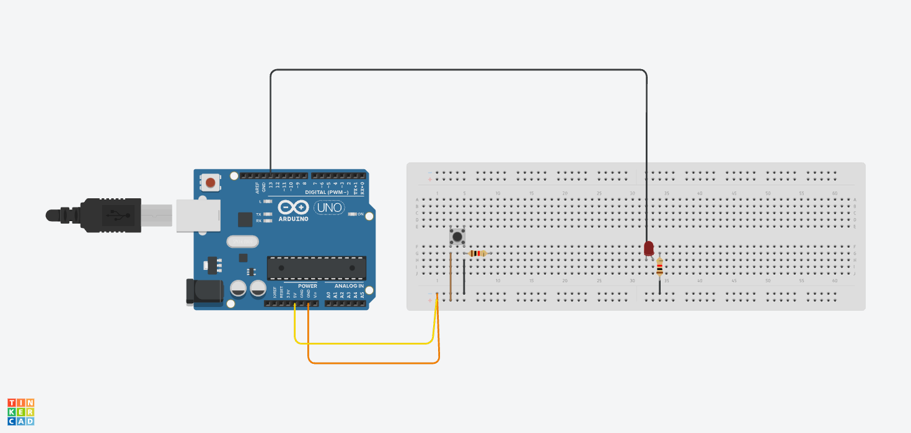

# WALL-E Robot: An Interactive Companion

| **Engineer** | **School** | **Area of Interest** | **Grade** |
|:--:|:--:|:--:|:--:|
|Anish N| Dougherty Valley High School | Computer Engineering | Incoming Senior


<div style="display: flex; align-items: center; justify-content: space-between;">
  
  
</div>

Have you ever wanted a personalized robot companion? Look no further! WALL-E is here, an innovative automative robot that responds to your presence. By simply moving your hand closer or farther away, you can change WALL-E's emotions and movements. This project combines Arduino programming, sensor technology, and expressive visual elements to make a robot come to life. This page serves as a comprehensive guide on my steps taken to learn and implement over a time period of two weeks. The principles of this project can serve as a powerful tool for individuals to communicate without voice. 

**Important skills learned**
-Soldering, Dremeling, Arduino programming, Ultrasonic sensor integration, Remote control system developement, App development and design, Wireless communication, Servo integration, Electrical wiring

### Modification: Android App!

In this milestone, I worked on controlling Robo from a remote controlled app. Key achievements include: 

- Installed OHM resistors and bluetooth module
- Coded and designed an Android app on MIT appinventor
- Adjusted arduino code to accomodate app


*Figure 8: Installation of new HC-05 bluetooth module*


*Figure 7: *Design of app and code on MITappinventor*

### Challenges

- Sending a text to the LCD screen through the app
- Enabling a system for the walle to continously move when button is pressed
- Wiring the bluetooth module appropiately 

### My code and explanations 

*Figure 6: *Visual flowchart of ultrasonic logic*
```c++
//pre-existing libraries
#include <LiquidCrystal_I2C.h>
#include <LedControl.h>
#include <Servo.h>
#include <NeoSWSerial.h>
// Pins for LED matrix connected to Arduino
int DIN = 11;
int CS = 9;
int CLK = 10;
int DIN_2 = 6;
int CS_2 = 8;
int CLK_2 = 7;

// Create instances for LCD and LED matrix
LiquidCrystal_I2C lcd(0x27, 16, 2);
LedControl ledmatrix = LedControl(DIN, CLK, CS);
LedControl ledmatrix_2 = LedControl(DIN_2, CLK_2, CS_2);

//create instances for bluetooth pins
NeoSWSerial bluetooth(A1, A0);


// Create instances for the Servos
Servo pan;
Servo tilt;
Servo leftBrow;
Servo rightBrow;

// Pins for the ultrasonic sensor
const int trigPin = 13;
const int echoPin = 12;

// Variable to measure distance
float duration, distance;

// bluetooth state variables 
unsigned char state = 'N';
char recVbuffer[32];
unsigned recVindex =0;

// Bitmap patterns for emotions
byte neutral_bmp[8] = {B00000000, B00111100, B01000010, B01011010, B01011010, B01000010, B00111100, B00000000};
byte happyL_bmp[8] = {B00000000, B00011100, B00100100, B01011100, B01011100, B00100100, B00011100, B00000000};
byte happyR_bmp[8] = {B00000000, B00111000, B00100100, B00111010, B00111010, B00100100, B00111000, B00000000};
byte loveL_bmp[8] = {B00011000, B00100100, B01000010, B10000001, B10000001, B10011001, B01100110, B00000000};
byte loveR_bmp[8] = {B00011000, B00100100, B01000010, B10000001, B10000001, B10011001, B01100110, B00000000};
byte sad_bmp[8] = {B10000001, B01000010, B00100100, B00011000, B00011000, B00100100, B01000010, B10000001};
byte surprisedL_bmp[8] = {B00000000, B01111110, B01000010, B01000010, B01000010, B01000010, B01111110, B00000000};
byte surprisedR_bmp[8] = {B00000000, B01111110, B01000010, B01000010, B01000010, B01000010, B01111110, B00000000};

// Function to display pattern on LED matrix
void displayPattern(byte patternL[], byte patternR[]) {
  for (int i = 0; i < 8; i++) {
    ledmatrix.setColumn(0, i, patternL[i]);
    ledmatrix_2.setColumn(0, i, patternR[i]);
  }
}

// Function to write emotion on LCD
void displayEmotion(String emotion) {
  lcd.clear();
  lcd.print(emotion);
}

// Function to move servos
void moveServos(int left, int right, int panIn, int tiltIn) {
  leftBrow.write(left);
  rightBrow.write(right);
  pan.write(panIn);
  tilt.write(tiltIn);
}

// Function to measure distance using ultrasonic sensor
float measureDistance() {
  digitalWrite(trigPin, LOW);
  delayMicroseconds(2);
  digitalWrite(trigPin, HIGH);
  delayMicroseconds(10);
  digitalWrite(trigPin, LOW);
  duration = pulseIn(echoPin, HIGH);
  return (duration * 0.0343) / 2;
}

//variables for led lights to make code quicker
unsigned long lastBlinkTime = 0;
bool isDisplayOn = true;


void setup() {
  // Debugging
  Serial.begin(9600);
  bluetooth.begin(9600);

  // Set up LCD
  lcd.init();
  lcd.backlight();

  // Set up LED matrices
  ledmatrix.shutdown(0, false);
  ledmatrix.setIntensity(0, 1);
  ledmatrix.clearDisplay(0);

  ledmatrix_2.shutdown(0, false);
  ledmatrix_2.setIntensity(0, 1);
  ledmatrix_2.clearDisplay(0);

  // Initialize columns with letters
  displayPattern(neutral_bmp, neutral_bmp);  // Initial neutral pattern
  displayEmotion("Neutral");  // Initial neutral emotion

  // Define input/outputs
  pinMode(trigPin, OUTPUT);
  pinMode(echoPin, INPUT);

  // Attach servos
  pan.attach(5);
  tilt.attach(4);
  leftBrow.attach(2);
  rightBrow.attach(3);

  // Set initial positions
  moveServos(60, 90, 130, 90);

  
}

void loop() {
//logic to display text on LCD screen
if(state == 255){
  if(bluetooth.available() > 0){
    char recieved = bluetooth.read();
    if(recieved == 0){
      state = 0;
      recVbuffer[recVindex] =0;
      displayEmotion(recVbuffer);
      Serial.println(recVbuffer);
      delay(3000);
    }
    if(recVindex < 33){
      recVbuffer[recVindex] = recieved;
      recVindex += 1;
      if(recVindex == 16){
        
        recVindex += 1;
      }

    }
  }
  return;
}
  distance = measureDistance();
//initalize bluetooth
if (bluetooth.available() > 0) {
  state = bluetooth.read();
  Serial.println((unsigned)state);

}

if(state ==255){
  recVindex =0;
  return;

}

  // Priority handling: Motion detection takes precedence
  if (distance <= 10 && distance > 0) {
    moveServos(60, 120, 130, 90);
    displayPattern(sad_bmp, sad_bmp);
    displayEmotion("Please back up!");
    for (int i = 90; i > 45; i--) {
      delay(10);
      tilt.write(i);
    }
    for (int j = 45; j < 135; j++) {
      delay(10);
      tilt.write(j);
    }
  } else if (distance <= 30 && distance > 10) {
    tilt.write(90);
    displayPattern(happyL_bmp, happyR_bmp);
    displayEmotion("I am so happy");
    leftBrow.write(90);
    rightBrow.write(90);
    for (int i = 150; i > 110; i--) {
      delay(10);
      pan.write(i);
    }
    for (int j = 110; j < 150; j++) {
      delay(10);
      pan.write(j);
    }
  } else if (distance <= 50 && distance > 30) {
    displayEmotion("I love you");
    moveServos(90, 90, 130, 90);
    displayPattern(loveL_bmp, loveR_bmp);
    delay(500);  // On for 500ms
    ledmatrix.clearDisplay(0);  // Turn off left matrix
    ledmatrix_2.clearDisplay(0);  // Turn off right matrix
    delay(500);  // Off for 500ms
  } else {
    //switch cases to handle buttons pressing in app
       switch (state) {
  case 'A':
    displayPattern(sad_bmp, sad_bmp);
    displayEmotion("I am Angry!");
     moveServos(60, 120, 130, 90);
    for (int i = 90; i > 45; i--) {
      delay(10);
      tilt.write(i);
    }
    for (int j = 45; j < 135; j++) {
      delay(10);
      tilt.write(j);
    }
    break;

  case 'H':
    displayPattern(happyL_bmp, happyR_bmp);
    displayEmotion("I am Happy!");
    moveServos(120, 60, 130, 90);
    leftBrow.write(90);
    rightBrow.write(90);
    for (int i = 150; i > 110; i--) {
      delay(10);
      pan.write(i);
    }
    for (int j = 110; j < 150; j++) {
      delay(10);
      pan.write(j);
    }
    break;

  case 'N':
    displayPattern(neutral_bmp, neutral_bmp);
    displayEmotion("Hello!");
    moveServos(120, 60, 130, 90);
    break;

  case 'B':
    displayEmotion("Love!");
    moveServos(120, 60, 130, 90);
    if (millis() - lastBlinkTime >= 500) {
      lastBlinkTime = millis();
      if (isDisplayOn) {
        ledmatrix.clearDisplay(0);
        ledmatrix_2.clearDisplay(0);
      } else {
        displayPattern(loveL_bmp, loveR_bmp);
      }
      isDisplayOn = !isDisplayOn;
    }
    break;

  case 'L':
    displayEmotion("Looking Left");
    if (tilt.read() > 20) {
      tilt.write(tilt.read() - 3);
      delay(1);
    }
    break;

  case 'R':
    displayEmotion("Looking Right");
    if (tilt.read() < 160) {
      tilt.write(tilt.read() + 3);
     delay(1);
    }
    break;

  case 'U':
    displayEmotion("Looking Up");
    if (pan.read() > 75) {
      pan.write(pan.read() - 3);
      delay(1);
    }
    break;

  case 'D':
    displayEmotion("Looking Down");
    if (pan.read() < 160) {
      pan.write(pan.read() + 3);
      delay(1);
    }
    break;

  case 'Z':
    // Do nothing, keep the current position
    break;

  default:
    displayPattern(neutral_bmp, neutral_bmp);
    displayEmotion("Hello!");
    moveServos(120, 60, 130, 90);  // Eyebrows up, slight head tilt up
    break;
}
}
}

```
### Process of modification 

Before coding the app, I first wired the bluetooth as depicted in the schematic. I had to be careful that the RX ran through a voltage divider, because it is rated for 3.3 V as opposed to arduinos 5V. 

To implement the buttons, I used the before/after press blocks available on MITappinventor. By switching the state to "Z" when the user lets go of the button, the code was able to identify that robo should stop moving. Therefore, by constantly switching before state, robo was able to stop/start almost instantaneously. To ensure that robo moved smoothly throughout the path, I changed the position by 3 degrees. Since this code was in the void loop, it was able to smoothly travel through the range of motion looking as if it was one motion. 

To implement the LCD screen, I faced a unique problem. If I simply sent the state to the arduino, the robot would not be able to differentiate between the other buttons, and the string. To combat this, I sent the byte number 255 before sending the text, and the byte number 0 after, signaling to the computer that a text would be in between these two signs. 255 worked since it is not in the ASCII table, so it would not be confused with my other buttons. In the code, I used a for loop to save the string into local memory, then printed it out to the LCD screen once it finished looping through which was signaled by the 0 byte. 


### Third Milestone: Working Robo!

<iframe width="560" height="315" src="https://www.youtube.com/embed/_Hg3DoX7dsg?si=uwZ-TM2jvdGeN9fH" title="YouTube video player" frameborder="0" allow="accelerometer; autoplay; clipboard-write; encrypted-media; gyroscope; picture-in-picture; web-share" referrerpolicy="strict-origin-when-cross-origin" allowfullscreen></iframe>

In this milestone, I assembled a working automative robot. Key achievements include: 

- Assembling each 3D printed part
- Finding suitable screws for each part
- Coding new patterns and logic for servo movement

### Challenges

- Miscalibrating servos
- Breaking servos due to non-grounded connections
- Coding for blinking LED lights


*Figure 5: My project*


*Figure 4: Wiring for all components*

The purple wire connecting the servos to the ground is crucial for proper functioning:

1. It completes the circuit, allowing current to return to the power source for servo operation.
2. It ensures consistent voltage, preventing short circuits.

During testing for milestone #3, one of my servos short-circuited, leading to this discovery.

### Components Overview

#### Arduino Uno

- **Microcontroller**: Acts as the project's brain, processing inputs and controlling outputs.
- **Connections**:
  - **Digital Pins**: Used for controlling servos and the LCD screen.
  - **Analog Pins**: Not utilized in this schematic.
  - **Power Pins**: Provide power to the breadboard and other components.

#### Breadboard

- **Prototyping Board**: Used for creating temporary circuits without soldering.
- **Connections**:
  - **Power Rails**: Distribute power and ground from the Arduino and battery pack.
  - **Signal Lines**: Connect various components to the Arduino's I/O pins.

#### Servos

- **Actuators**: Convert electrical signals into mechanical movement.
- **Connections**:
  - **Signal Wires (Yellow)**: Connect to Arduino digital pins for PWM control.
  - **Power Wires (Red)**: Connected to the positive terminal of the battery pack.
  - **Ground Wires (Black)**: Connected to the breadboard ground, linked to Arduino ground via the purple wire.

#### Ultrasonic Sensor (HC-SR04)

- **Distance Measurement**: Uses ultrasonic waves to measure distance to an object.
- **Connections**:
  - **VCC**: Connected to Arduino's 5V pin for power.
  - **GND**: Connected to the breadboard ground.
  - **Trig and Echo Pins**: Connected to specific digital pins on the Arduino for sending and receiving signals.

#### 16x2 LCD Screen

- **Display**: Shows information such as sensor readings or system status.
- **Connections**:
  - **VCC**: Connected to Arduino's 5V pin for power.
  - **GND**: Connected to the breadboard ground.
  - **Data Pins**: Connected to specific digital pins on the Arduino for data input.
  - **Contrast Pin**: Connected to a potentiometer (not shown) for adjusting display contrast.
  - **Backlight**: Powered from the same source as the LCD.

#### 8x8 LED Matrix

- **Visual Indicator**: Used for displaying patterns or simple graphics.
- **Connections**:
  - **VCC**: Connected to Arduino's 5V pin for power.
  - **GND**: Connected to the breadboard ground.
  - **Control Pins**: Connected to specific digital pins on the Arduino for data and control signals.

#### 4xAAA Battery Pack

- **Power Supply**: Provides additional power to servos to ensure sufficient current for operation.
- **Connections**:
  - **Positive Terminal**: Connected to the breadboard power rail for supplying voltage to servos.
  - **Negative Terminal**: Connected to the breadboard ground, establishing a common ground with the Arduino.

#### Wires and Connections

- **Power Wires (Red)**: Carry power from Arduino and battery pack to components.
- **Ground Wires (Black/Purple)**: Create a unified ground for all components, essential for consistent operation.
- **Signal Wires (Yellow/Other Colors)**: Transmit control signals from Arduino to servos, LCD screen, ultrasonic sensor, and LED matrix.

### Code and explanations 
```c++ 

// Include libraries for LCD, LED matrix, and Servo motors
#include <LiquidCrystal_I2C.h>  // Library for I2C LCD
#include <LedControl.h>         // Library for LED matrix
#include <Servo.h>              // Library for Servo motors

// Pins for LED matrix connected to Arduino
int DIN = 11;
int CS = 9;
int CLK = 10;
int DIN_2 = 6;
int CS_2 = 8;
int CLK_2 = 7;

// Create instances for LCD and LED matrix
LiquidCrystal_I2C lcd(0x27, 16, 2);  // LCD instance
LedControl ledmatrix = LedControl(DIN, CLK, CS);  // LED matrix instance (left)
LedControl ledmatrix_2 = LedControl(DIN_2, CLK_2, CS_2);  // LED matrix instance (right)

// Create instances for the Servos
Servo pan;         // Pan servo instance
Servo tilt;        // Tilt servo instance
Servo leftBrow;    // Left eyebrow servo instance
Servo rightBrow;   // Right eyebrow servo instance

// Pins for the ultrasonic sensor
const int trigPin = 13;   // Trigger pin for ultrasonic sensor
const int echoPin = 12;   // Echo pin for ultrasonic sensor

// Variables to measure distance
float duration, distance;

// Bitmaps for different emotional expressions on LED matrix
byte neutral_bmp[8] = {
  B00000000,
  B00111100,
  B01000010,
  B01011010,
  B01011010,
  B01000010,
  B00111100,
  B00000000
};
byte happyL_bmp[8] = {
  B00000000,
  B00011100,
  B00100100,
  B01011100,
  B01011100,
  B00100100,
  B00011100,
  B00000000
};
byte happyR_bmp[8] = {
  B00000000,
  B00111000,
  B00100100,
  B00111010,
  B00111010,
  B00100100,
  B00111000,
  B00000000
};
byte loveL_bmp[8] = {
  B00011000,
  B00100100,
  B01000010,
  B10000001,
  B10000001,
  B10011001,
  B01100110,
  B00000000
};
byte loveR_bmp[8] = {
  B00011000,
  B00100100,
  B01000010,
  B10000001,
  B10000001,
  B10011001,
  B01100110,
  B00000000
};
byte sad_bmp[8] = {
  B10000001,
  B01000010,
  B00100100,
  B00011000,
  B00011000,
  B00100100,
  B01000010,
  B10000001
};
byte surprisedL_bmp[8] = {
  B00000000,
  B01111110,
  B01000010,
  B01000010,
  B01000010,
  B01000010,
  B01111110,
  B00000000
};
byte surprisedR_bmp[8] = {
  B00000000,
  B01111110,
  B01000010,
  B01000010,
  B01000010,
  B01000010,
  B01111110,
  B00000000
};

// Function to display pattern on LED matrix
void displayPattern(byte patternL[], byte patternR[]) {
  for (int i = 0; i < 8; i++) {
    ledmatrix.setColumn(0, i, patternL[i]);
    ledmatrix_2.setColumn(0, i, patternR[i]);
  }
}

// Function to write emotion on LCD
void displayEmotion(const char* emotion) {
  lcd.clear();
  lcd.print(emotion);
}

// Function to move servos
void moveServos(int left, int right, int panIn, int tiltIn) {
  leftBrow.write(left);
  rightBrow.write(right);
  pan.write(panIn);
  tilt.write(tiltIn);
}

// Function to measure distance using ultrasonic sensor
float measureDistance() {
  digitalWrite(trigPin, LOW);
  delayMicroseconds(2);
  digitalWrite(trigPin, HIGH);
  delayMicroseconds(10);
  digitalWrite(trigPin, LOW);
  duration = pulseIn(echoPin, HIGH);
  return (duration * 0.0343) / 2;
}

void setup() {
  // Debugging
  Serial.begin(9600);

  // Set up LCD
  lcd.init();
  lcd.backlight();

  // Set up LED matrices
  ledmatrix.shutdown(0, false);
  ledmatrix.setIntensity(0, 1);
  ledmatrix.clearDisplay(0);

  ledmatrix_2.shutdown(0, false);
  ledmatrix_2.setIntensity(0, 1);
  ledmatrix_2.clearDisplay(0);

  // Initialize columns with letters
  displayPattern(neutral_bmp, neutral_bmp);  // Initial neutral pattern
  displayEmotion("Neutral");  // Initial neutral emotion

  // Define input/outputs
  pinMode(trigPin, OUTPUT);
  pinMode(echoPin, INPUT);

  // Attach servos to respective pins
  pan.attach(5);
  tilt.attach(4);
  leftBrow.attach(2);
  rightBrow.attach(3);

  // Set initial positions of servos
  moveServos(60, 90, 130, 90);  // Adjust as needed
}

void loop() {
  // Measure distance using ultrasonic sensor
  distance = measureDistance();
  Serial.println(distance);

  // Logic to display emotions based on distance
  if (distance <= 10 && distance > 0) {
    // Display sad emotion and prompt to back up
    moveServos(60, 120, 130, 90);  // Adjust as needed
    displayPattern(sad_bmp, sad_bmp);
    displayEmotion("Please back up!");

    // Move tilt servo up and down for effect
    for (int i = 90; i > 45; i--) {
      delay(10);
      tilt.write(i);
    }
    for (int j = 45; j < 135; j++) {
      delay(10);
      tilt.write(j);
    }
  } else if (distance <= 30 && distance > 10) {
    // Display happy emotion and perform a movement
    tilt.write(90);  // Reset tilt position
    displayPattern(happyL_bmp, happyR_bmp);
    displayEmotion("I am so happy");

    // Move pan servo left and right for effect
    for (int i = 150; i > 110; i--) {
      delay(10);
      pan.write(i);
    }
    for (int j = 110; j < 150; j++) {
      delay(10);
      pan.write(j);
    }
  } else if (distance <= 50 && distance > 30) {
    // Display love emotion and light up LED matrix
    displayEmotion("I love you");
    moveServos(90, 90, 130, 90);  

    // Display heart pattern on LED matrix(blinking)
    displayPattern(loveL_bmp, loveR_bmp);
    delay(500);  // On for 500ms
    ledmatrix.clearDisplay(0);  // Turn off left matrix
    ledmatrix_2.clearDisplay(0);  // Turn off right matrix
    delay(500);  // Off for 500ms
  } else {
    // Default to neutral emotion and initial servo position
    displayPattern(neutral_bmp, neutral_bmp);
    displayEmotion("Hello!");
    moveServos(120, 60, 130, 90);  
  }
}

```

This code is mostly the same as milestone 2, but with minor tweaks. 

## Second Milestone: Integrating the components

<iframe width="560" height="315" src="https://www.youtube.com/embed/WgoiZ1K0GwM?si=B_8jLmUFtSOCsSyv" title="YouTube video player" frameborder="0" allow="accelerometer; autoplay; clipboard-write; encrypted-media; gyroscope; picture-in-picture; web-share" referrerpolicy="strict-origin-when-cross-origin" allowfullscreen></iframe>

Using the Arduino IDE, I've successfully implemented multiple functions for each component of the WALL-E robot, as highlighted in the schematic below. Key achievements include:

- Wiring and implementing the ultrasonic sensor and multiple servos
- Utilizing the ultrasonic sensor to calculate distance by measuring reflected sound waves
- Converting sensor data into tangible distances to trigger various functions

### Next Steps
Before the final draft, I plan to:
1. Create and assemble the 3D printed WALL-E bot
2. Install components correctly
3. Fine-tune the code to display emotions corresponding to the correct distances


*Figure 3: Wiring for all components*

[Ultra-sonic sensor guide](https://projecthub.arduino.cc/Isaac100/getting-started-with-the-hc-sr04-ultrasonic-sensor-7cabe1):

### My code and explanations 
```c++
//packages installed from the internet
#include <LiquidCrystal_I2C.h>
#include <LedControl.h>
#include <Servo.h>

// Pins for LED matrix connected to arduino
int DIN = 11;
int CS = 9;
int CLK = 10;
int DIN_2 = 6;
int CS_2 = 8;
int CLK_2 = 7;

 // Create instances for LCD and LED matrix
LiquidCrystal_I2C lcd(0x27, 16, 2);
LedControl ledmatrix = LedControl(DIN, CLK, CS);
LedControl ledmatrix_2 = LedControl(DIN_2, CLK_2, CS_2);

//create instances for the Servos
Servo pan;  
Servo tilt;
Servo leftBrow;
Servo rightBrow;

//pins for the ultrasonic sensor
const int trigPin = 13;  
const int echoPin = 12;

//variable to measure distance
float duration, distance;  

// Define byte arrays with LED matrix patterns for each emotion
//0 represents no light while 1 represents on 
byte happyL_bmp[8] = {
  B00000000, 
  B00011100, 
  B00100100, 
  B01011100,
  B01011100,
  B00100100, 
  B00011100, 
  B00000000
};
byte happyR_bmp[8] = {
  B00000000, 
  B00011100, 
  B00100100, 
  B01011100,
  B01011100, 
  B00100100, 
  B00011100, 
  B00000000
};
byte neutralL_bmp[8] = {
  B00000000, 
  B00111100, 
  B01000010, 
  B01011010,
  B01011010, 
  B01000010, 
  B00111100, 
  B00000000
};
byte neutralR_bmp[8] = {
  B00000000, 
  B00111100, 
  B01000010, 
  B01011010,
  B01011010,
   B01000010, 
   B00111100, 
   B00000000
};
byte sadL_bmp[8] = {
  B00000000, 
  B00111100, 
  B01000010, 
  B01011010,
  B00111010,
  B00010010, 
  B00001100, 
  B00000000
};
byte sadR_bmp[8] = {
  B00000000, 
  B00001100, 
  B00010010, 
  B00111010,
  B01011010,
  B01000010, 
  B00111100, 
  B00000000
};
byte surprisedL_bmp[8] = {
  B01111110, 
  B10000001, 
  B10000001, 
  B10011001,
  B10011001, 
  B10000001, 
  B10000001, 
  B01111110
};
byte surprisedR_bmp[8] = {
  B01111110, 
  B10000001, 
  B10000001, 
  B10011001,
  B10011001, 
  B10000001, 
  B10000001, 
  B01111110
};

// Function to display pattern on LED matrix
//uses for loop to iterate through each led on the matrix 
void displayPattern(byte patternL[], byte patternR[]) {
  for (int i = 0; i < 8; i++) {
    ledmatrix.setColumn(0, i, patternL[i]);
    ledmatrix_2.setColumn(0, i, patternR[i]);
  }
  //all serial prints are for debugging
  Serial.println("Pattern displayed");
}

// Function to write emotion on LCD
void displayEmotion(const char* emotion) {
  lcd.clear();
  lcd.print(emotion);
  Serial.print("Emotion displayed: ");
  Serial.println(emotion);
}

// Function to move servos
void moveServos(int left, int right, int panIn, int tiltIn) {
  leftBrow.write(left);
  rightBrow.write(right);
  pan.write(panIn);
  tilt.write(tiltIn);
  Serial.println("Servos moved");
}

// Function to measure distance using ultrasonic sensor
float measureDistance() {
  digitalWrite(trigPin, LOW);  
  delayMicroseconds(2);  
  digitalWrite(trigPin, HIGH);  
  delayMicroseconds(10);  
  digitalWrite(trigPin, LOW);
  //how it calculates distance  
  duration = pulseIn(echoPin, HIGH);  
  return (duration * 0.0343) / 2;
}

void setup() {
  //debugging
  Serial.begin(9600);
  
  // Set up LCD
  lcd.init();
  lcd.backlight();
  
  // Set up LED matrices
  ledmatrix.shutdown(0, false);
  ledmatrix.setIntensity(0, 1);
  ledmatrix.clearDisplay(0);
  
  ledmatrix_2.shutdown(0, false);
  ledmatrix_2.setIntensity(0, 1);
  ledmatrix_2.clearDisplay(0);
  
  // Initialize columns with letters
  displayPattern(neutralL_bmp, neutralR_bmp);  // Initial neutral pattern
  displayEmotion("Neutral");  // Initial neutral emotion
  
  //define input/outputs
  pinMode(trigPin, OUTPUT);  
  pinMode(echoPin, INPUT);  
  
  // Attach servos
  pan.attach(5); 
  tilt.attach(4);
  leftBrow.attach(2);
  rightBrow.attach(3);
  
  // Set initial positions
  moveServos(0, 0, 0, 0);
}

void loop() {
  distance = measureDistance();
  Serial.print("Distance: ");  
  Serial.println(distance);  
  

  // logic to display emotions based on distance
  if (distance <= 10) {
    displayPattern(happyL_bmp, happyR_bmp);
    displayEmotion("Happy");
    moveServos(100, 0, 0, 0);
  } else if (distance <= 20) {
    displayPattern(surprisedL_bmp, surprisedR_bmp);
    displayEmotion("Surprised");
    moveServos(100, 0, 100, 0);
  } else if (distance <= 30) {
    displayPattern(neutralL_bmp, neutralR_bmp);
    displayEmotion("Neutral");
    moveServos(100, 0, 0, 0);
  } else {
    displayPattern(sadL_bmp, sadR_bmp);
    displayEmotion("Sad");
    moveServos(100, 0, 0, 0);
  }

  // Move servos in loop
  moveServos(100, 0, 100, 0);
  delay(1000);
  moveServos(0, 100, 0, 100);
  delay(1000);
}
```


# First Milestone: Lighting up screens

<iframe width="560" height="315" src="https://www.youtube.com/embed/YkfFGZ1TbZA?si=SSonITQkPW6j-yTY" title="YouTube video player" frameborder="0" allow="accelerometer; autoplay; clipboard-write; encrypted-media; gyroscope; picture-in-picture; web-share" referrerpolicy="strict-origin-when-cross-origin" allowfullscreen></iframe>

In this initial phase, I focused on:

- Getting the LED lights and LCD screen to function properly
- Displaying text and my initials on the screens
- Learning to code the LED lights and LCD screen using the Arduino IDE

Moving forward, I aim to:

- Integrate all components, including servos
- Implement proximity-based reactions using the ultrasonic sensor
- Begin construction of the physical robot using 3D printed parts


*Figure 2: Wiring for LED and LCD Screens*


# Bill of Materials


| **Part** | **Note** | **Price** | **Link** |
|:--:|:--:|:--:|:--:|
| HC-05 Bluetooth Module | Connect bluetooth with phone allowing servos to move | $10.39 | <a href="https://www.amazon.com/HiLetgo-Wireless-Bluetooth-Transceiver-Arduino/dp/B071YJG8DR"> Link </a> |
| Microservos(2x) | Controlling eyebrows | $7 | <a href="https://www.amazon.com/Diitao-Geared-Helicopter-Airplane-Controls/dp/B0B885YW36/ref=asc_df_B0B885YW36/?tag=hyprod-20&linkCode=df0&hvadid=692875362841&hvpos=&hvnetw=g&hvrand=5259485647923795901&hvpone=&hvptwo=&hvqmt=&hvdev=c&hvdvcmdl=&hvlocint=&hvlocphy=9032183&hvtargid=pla-2281435178098&mcid=21a1d1f34f8237598b1b6c5e3c0c80b7&hvocijid=5259485647923795901-B0B885YW36-&hvexpln=73&gad_source=1&th=1"> Link </a> |
| Servos(2x) MG995 | Controlling the head and neck | $10.39 | <a href="https://www.amazon.com/180%C2%B0Metal-Waterproof-Airplane-Helicopter-Mechanical/dp/B09JWK2GB3/ref=asc_df_B09JWK2GB3/?tag=hyprod-20&linkCode=df0&hvadid=692875362841&hvpos=&hvnetw=g&hvrand=2101373794074905324&hvpone=&hvptwo=&hvqmt=&hvdev=c&hvdvcmdl=&hvlocint=&hvlocphy=9032183&hvtargid=pla-2281435178138&mcid=c8149b27222b305fba9ddb599ece2ec9&hvocijid=2101373794074905324-B09JWK2GB3-&hvexpln=73&gad_source=1&th=1"> Link </a> |
| Ultrasonic sensor HC-SR04| Detect motion using sound waves | $6.40 |<a href=" <https://www.amazon.com/HC-SR04-Ultrasonic-Distance-Measuring-MEGA2560/dp/B088BT8CDW/ref=asc_df_B088BT8CDW/?tag=hyprod-20&linkCode=df0&hvadid=692875362841&hvpos=&hvnetw=g&hvrand=7609019556708301176&hvpone=&hvptwo=&hvqmt=&hvdev=c&hvdvcmdl=&hvlocint=&hvlocphy=9032183&hvtargid=pla-2281435177658&psc=1&mcid=a96bc6df1ca933c4baf6476b09ca6103&hvocijid=7609019556708301176-B088BT8CDW-&hvexpln=73&gad_source=1"> Link </a> |
|8 by 8 LED matrix | Controlling eye emotions | $4.88 | <a href="https://www.walmart.com/ip/clearance-LED-Matrix-Control-Module-8x8-64-Bit-Panel-SPI-Interface-DC5V-Single-Board-Computers/6434003609?wmlspartner=wlpa&selectedSellerId=102484000&adid=222222222276434003609_102484000_167031288608_21207942474&wl0=&wl1=g&wl2=c&wl3=697286723488&wl4=pla-2298622009165&wl5=9032183&wl6=&wl7=&wl8=&wl9=pla&wl10=5386222348&wl11=online&wl12=6434003609_102484000&veh=sem&gad_source=1&gclid=CjwKCAjw1920BhA3EiwAJT3lSRxWi1_gpi8FM95eynM6ggweOeLFIsdYQRsJ3R6aQMW4fitOrpKxqRoCOQEQAvD_BwE"> Link </a> |
| LCD Screen | displaying message| $9.99 | <a href="https://www.amazon.com/SunFounder-Serial-Module-Display-Arduino/dp/B019K5X53O/ref=asc_df_B019K5X53O/?tag=hyprod-20&linkCode=df0&hvadid=692875362841&hvpos=&hvnetw=g&hvrand=17963529301046934762&hvpone=&hvptwo=&hvqmt=&hvdev=c&hvdvcmdl=&hvlocint=&hvlocphy=9032183&hvtargid=pla-2281435178338&mcid=d8869fd4bb8c3e78a3b0ed4cc311f13b&hvocijid=17963529301046934762-B019K5X53O-&hvexpln=73&gad_source=1&th=1"> Link </a> |
|Battery pack| Power Servos | $5.98 | <a href="https://www.amazon.com/LAMPVPATH-Battery-Holder-Leads-Wires/dp/B07T7MTRZX/ref=asc_df_B07T7MTRZX/?tag=hyprod-20&linkCode=df0&hvadid=692875362841&hvpos=&hvnetw=g&hvrand=7413704186770057061&hvpone=&hvptwo=&hvqmt=&hvdev=c&hvdvcmdl=&hvlocint=&hvlocphy=9032183&hvtargid=pla-2281435178858&psc=1&mcid=bc8a49e084dd3e049c6d15e853396eaa&hvocijid=7413704186770057061-B07T7MTRZX-&hvexpln=73&gad_source=1"> Link </a> |
|Arduino UNO | Code processor | $27.60| <a href="https://www.amazon.com/Arduino-A000066-ARDUINO-UNO-R3/dp/B008GRTSV6/ref=asc_df_B008GRTSV6/?tag=hyprod-20&linkCode=df0&hvadid=692875362841&hvpos=&hvnetw=g&hvrand=17095102518390285633&hvpone=&hvptwo=&hvqmt=&hvdev=c&hvdvcmdl=&hvlocint=&hvlocphy=9032183&hvtargid=pla-2281435179978&mcid=8d4415853f19330eb6cb8c1e7f18a8ed&hvocijid=17095102518390285633-B008GRTSV6-&hvexpln=73&gad_source=1&th=1"> Link </a> |
| Mini breadboard| helps providing processing power to servos| $6.75 | <a href="https://www.amazon.com/BB400-Solderless-Plug-BreadBoard-tie-points/dp/B0040Z1ERO/ref=asc_df_B0040Z1ERO/?tag=hyprod-20&linkCode=df0&hvadid=692875362841&hvpos=&hvnetw=g&hvrand=10172484802440772633&hvpone=&hvptwo=&hvqmt=&hvdev=c&hvdvcmdl=&hvlocint=&hvlocphy=9032183&hvtargid=pla-2281435177658&psc=1&mcid=df8a82d513d937b38ac19209b20d38be&hvocijid=10172484802440772633-B0040Z1ERO-&hvexpln=73&gad_source=1">Link </a> |
|Various M2 && M3 screws |assembly toolbox |$4.99 |<a href="https://www.amazon.com/DYWISHKEY-Pieces-Screws-Washers-Assortment/dp/B0CS9XVPLV/ref=sr_1_5?dib=eyJ2IjoiMSJ9.dh4QCEmZvciH5SBORhOCf75bMouvuVRAsfpzKgwH7vL3qE9hVvCkxHXIMEjY3AClbjCj1nowLTLXTWy9HpeeP_tURjiAhK6mKqwFIo94IAfClGjb6uS9TiMjzUswBqIJIi-8yiN-r17e9sW8e3-ywAt1h08lW7GXovk9ds6Vhvh11-V1cUFeQ_gNbs6nwPZtDqS5q0gNuZNU8O0UmgbdjWT7UU9cZF7B8GTORgzF8qw.WdawQ8PMaipfzxLESkhHX3kY3M3VV__lwt6X6uq1M5Y&dib_tag=se&hvadid=409999246310&hvdev=c&hvlocphy=9032183&hvnetw=g&hvqmt=b&hvrand=2835700877264352192&hvtargid=kwd-933490677&hydadcr=26614_10407671&keywords=m3%2Bscrews&qid=1721257749&sr=8-5&th=1">Link </a> |
|various jumper cables|connecting all components together|$5.98|<a href=" https://www.amazon.com/Elegoo-EL-CP-004-Multicolored-Breadboard-arduino/dp/B01EV70C78/ref=asc_df_B01EV70C78/?tag=hyprod-20&linkCode=df0&hvadid=692875362841&hvpos=&hvnetw=g&hvrand=743854505051106635&hvpone=&hvptwo=&hvqmt=&hvdev=c&hvdvcmdl=&hvlocint=&hvlocphy=9032183&hvtargid=pla-2281435178578&mcid=6d8a7ca3c39a3ad4877ede949dc655a6&hvocijid=743854505051106635-B01EV70C78-&hvexpln=73&gad_source=1&th=1"> Link </a> |
|3D printed parts|Container of robo|

# Arduino Starter Project

<iframe width="560" height="315" src="https://www.youtube.com/embed/IUZZ2V6nGmU?si=mzgKdNSG2Q01wio3" title="YouTube video player" frameborder="0" allow="accelerometer; autoplay; clipboard-write; encrypted-media; gyroscope; picture-in-picture; web-share" referrerpolicy="strict-origin-when-cross-origin" allowfullscreen></iframe>

I chose this starter project because it would give me a good introduction into how to code and use the Arduino. Additionally, it gave me great experience with soldering, and electrical components. I now have a basic idea of a circuit, and understand the layout of the breadboard. This knowledge has given me the confidence to continue on my main project, which will use the Arduino extensively, as well as plenty of electrical components. 


*Figure 1: Arduino and breadboard wiring*

- **Yellow**: provides 5V of power
- **Orange**: connects to ground 
- **Brown**: gives power to button 
- **Black**: gives ground to button 
- **Blue**: provides digital cue 
- **Black**: provides ground to LED with resistor to stop voltage 

When the button is pressed, the circuit is allowed to connect, causing the LED to light up. It is also possible to reverse this effect with the code. 

[Project Guide](https://docs.arduino.cc/built-in-examples/digital/Button/):

```cpp
const int buttonPin = 2;  // the number of the pushbutton pin
const int ledPin = 13;    // the number of the LED pin

// variables will change:
int buttonState = 0;  // variable for reading the pushbutton status

void setup() {
  // initialize the LED pin as an output:
  pinMode(ledPin, OUTPUT);
  // initialize the pushbutton pin as an input:
  pinMode(buttonPin, INPUT);
}

void loop() {
  // read the state of the pushbutton value:
  buttonState = digitalRead(buttonPin);

  // check if the pushbutton is pressed. If it is, the buttonState is HIGH:
  if (buttonState == HIGH) {
    // turn LED on:
    digitalWrite(ledPin, HIGH);
  } else {
    // turn LED off:
    digitalWrite(ledPin, LOW);
  }
}

```

Switching HIGH and LOW will reverse the effect of the LED light. Instead of turning on when pressed, it will turn off when pressed. 
